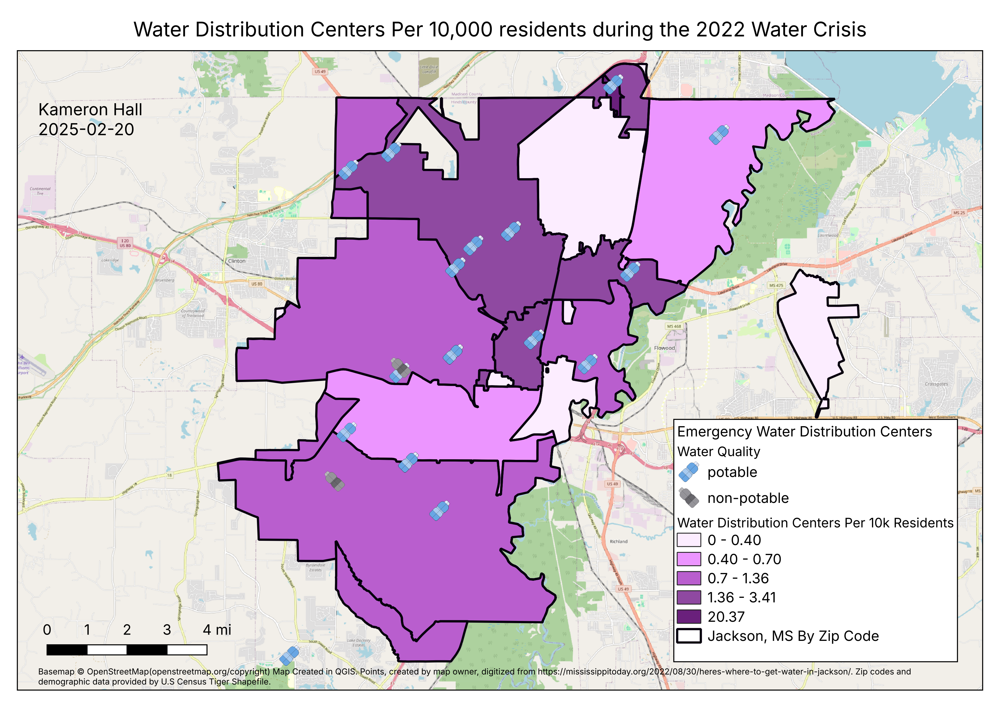

**Creator**: Kameron Hall\
**Date**: 2025-02-19\
**Programming Language**: Python\
**Packages used**: Geopandas, pandas, mapclassify, ipyleaflet, Jupyter Notebook
**Update Frequency**: Occasionally

# Purpose
The purpose of the scripted portion of this project was to perform QA/QC when performing data analysis on tabular and GIS data, and show the workflows I used to generate map layouts. Some functions the script performs include masking data to polygon feature(s), ensuring data is correctly projected, and performing multi-step data processing. The workflows presented in this project were used for my analysis of the [Jackson, MS water crisis of 2022](https://disasterphilanthropy.org/disasters/jackson-mississippi-water-crisis/).
# Files Overview

## layouts/FINAL_Jackson_MS_Water_Crisis_0001.png

The purpose of this map is to show the extent of the [Pearl River's flood on 08-29-2022](https://water.noaa.gov/gauges/jacm6) during the August 2022 flood. The flood's crest was 35.38 ft according to [NOAA records](https://water.noaa.gov/gauges/jacm6), but geospatial projections for the river's flood crest were not created for 35ft [ArcGIS Online](https://www.arcgis.com/home/item.html?id=204873fab8434a34896bb7a35543d8e2), so I used estimates based on a 34 ft extent. I decided to choose the lower estimate to avoid misrepresenting the extent of flood. The J.H. Fewell and O B Curtis Water Treatment Plants were included to show the estimated proximity of the flood's crest to these water treatment plants. Flood Extent data was provided by NOAA [ArcGIS Online](https://www.arcgis.com/home/item.html?id=204873fab8434a34896bb7a35543d8e2), and the Pearl River linear feature was obtained from [OpenStreetMap](https://www.openstreetmap.org) data.

## layouts/FINAL_Jackson_MS_Water_Crisis_0002.png

The purpose of this map is to visualize the populations surrounding emergency water distribution centers and show the estimated number of distribution centers per 10,000 residents based on zip code population aggregations. Addresses for the locations of distribution centers were obtained from [Mississippi Today](https://mississippitoday.org/2022/08/30/heres-where-to-get-water-in-jackson/).

## data_processing.py
This script contains the class I created for processing common geoprocessing workflows pertaining to this project. The **JacksonDataProcessing** class packages all the geoprocessing workflows and provides useful defaults in the form of class parameters. This allows me to utilize these workflows for future projects if similar circumstances arise. The purpose or function of the class methods are detailed in the method's docstrings.

## data_processing_walkthrough_3.html
A html file containing steps for how I used the **JacksonDataProcessing** class from the data_processing.py module to perform spatial and tabular data analysis and processing. May require viewing inside a browser. The html was made from Jupyter Notebook output.
## data_processing_walkthrough.ipynb
A Jupyter Notebook file containing steps for how I used the **JacksonDataProcessing** class from the data_processing.py module to perform spatial and tabular data analysis and processing.
# Acknowledgements
[Center for Disaster Philanthropy](https://disasterphilanthropy.org/about/)\
[Mississippi Today](https://mississippitoday.org/about-us/)\
[NOAA](https://www.noaa.gov/about-our-agency)\
[NOAA NWS](https://www.weather.gov/about/)\
[© OpenStreetMap contributors](https://www.openstreetmap.org/copyright)

